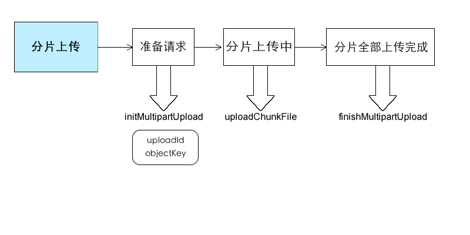
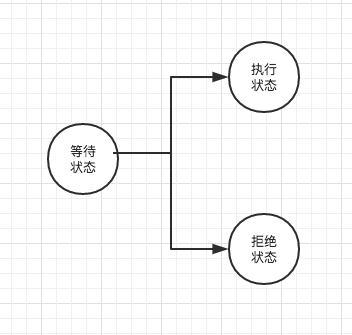
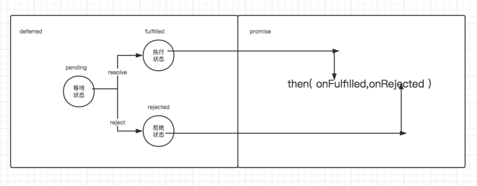
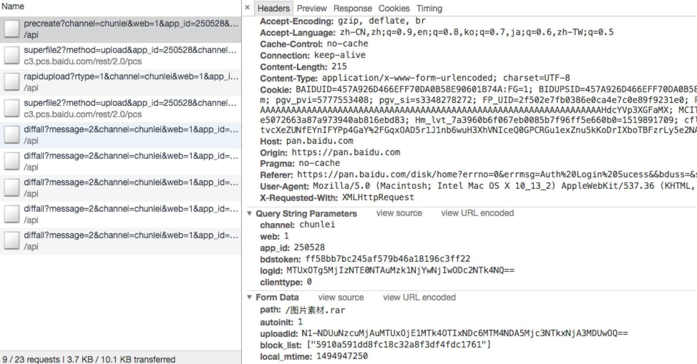
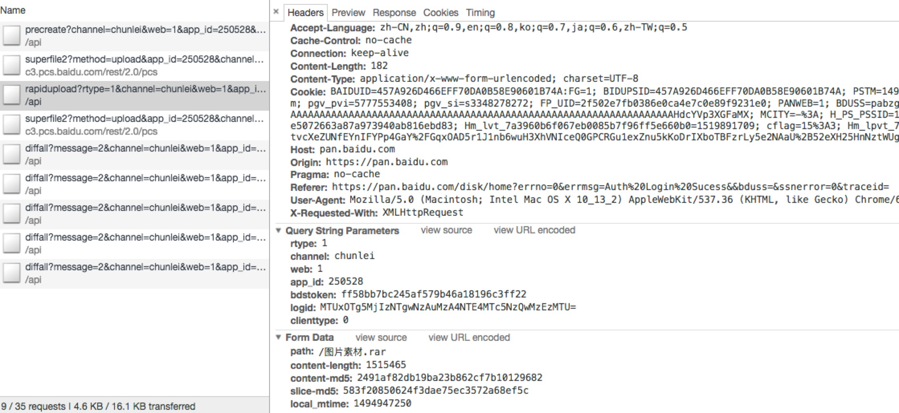
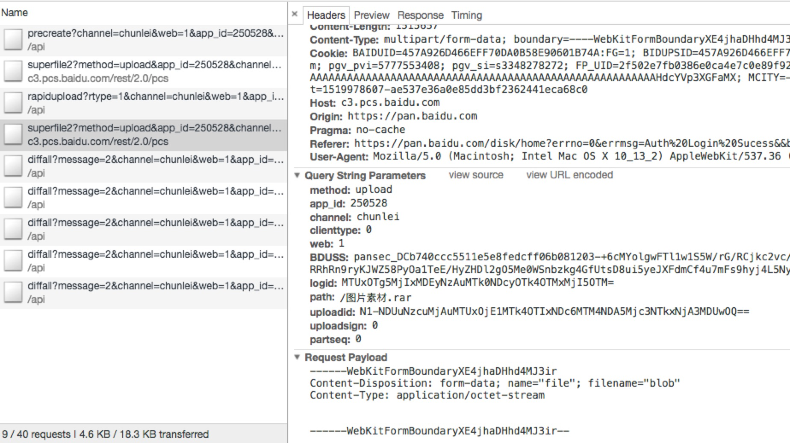

# 文件上传
## 上传功能
* 文件多选
* 格式过滤
* 拖拽（文件 & 文件夹）
* 截屏粘贴
* 文件内容读取
* 图片预览 & 剪裁
* 上传进度跟踪

PS： 截屏粘贴是指，如果剪切板里面存在图片数据，是可以通过 CTRL + V 将此图片作为文件添加到文件上传组件中的。

## 上传优化

### 并发上传
> 选择一个合适的并发数

* 并发数越多，服务端压力越大，所以选择并发数不能太大！
* 每个浏览器都有固定的最大并发数限制，所以选择并发数不能超出这个值。

一般可以通过 **文件队列** 的方式，来实现多文件并发上传。


### 分片上传
分片上传，就是把一个大的文件分成若干片，一片一片的传输。如果传输中断，仅需重传出错的分片，而不需要重传整个文件，大大减少了重传开销。


采用分片上传的优势：

 * 更强容错能力
 * 可以模拟暂停与继续：当前分片中断后
 * 利用并发提速：分片并发上传
 * 更精准的速度跟踪 

---
#### 分片流程
* 利用`Blob`对象的`slice`方法把文件分成 N 份。
* 遍历 N 次，利用`FormData`创建需要提交的数据，上传数据。

> 相关代码如下：

```js
const blobSlice = file.slice || file.mozSlice || file.webkitSlice;
blob = blobSlice.call(file, start, end);
const formData = new FormData();
const index = parseInt(start / chunkSizeByte, 10);
formData.append('chunk', index);
formData.append('uploadId', file.uploadId);
formData.append('objectKey', file.objectKey);
formData.append(file.name, blob);
```

### demo - 分片上传
##### 代码示例：[demo](http://localhost:3000/)
##### 上传流程：


##### 功能参数：
| 参数          | 类型            | 说明            | 默认值   |
|:-------------  |:------------ | :-------------- |:------- |
| fileChunkMinSize      | string / number   | 文件允许分片的最小值 | '100m' |
| chunkSize      | string / number   | 文件分片大小, 默认单位b，0不分片 | '5m' |
| chunkRetries   | number   | 文件分片上传重试次数 | 0 |
| chunkProcessThreads  | number   | 分片上传并发数 | 2 |

>实现以上功能的流程图：


#### promise/deferred 模式
* promise操作只会在以下3种状态中的一种：等待态（Pending）、执行态（Fulfilled）和拒绝态（Rejected）
* promise的状态只会出现从等待状态向执行态或者拒绝态转化，不可以逆转。执行态和拒绝态之间不能相互转换
* promise状态一旦被转换，就不能被更改。


promise/deferred 模式 其实包含两部分：Promise 和 Deferred。

 * Deferred主要是用于内部，来维护异步模型的状态。
 * Promise只要用于外部，通过then()方法，暴露给外部调用，以添加业务逻辑和业务的组装。

promise 和 deferred的关系图


> deferred对象通过resolve方法，改变自身状态为执行态，并触发then()方法的onfulfilled回调函数

> deferred对象通过reject方法，改变自身状态为拒绝态，并触发then()方法的onrejected回调函数


---


> 当然，分片也会有一定的副作用，本来是一个请求，分片后变成了多个请求，自然会带来网络开销。

以下是通过测试3个30M的文件在3个并发下调整不同的分片大小得出的总体时间消耗表。


可以看出来，分片越小，时间消耗越大，尤其是分片大小小到256K的时候，时间花费增长特别明显。

> 那么，如何选择一个合适的分片大小？

* 分片越小，请求越多，开销越大。所以不能设置得太小。
* 分片越大，灵活度越小，前面所说的那些优势就会相对越不明显。故不能太小。
* 服务端一般都会有个固定大小的接受buffer, 分片的大小最好是这个值的整数倍。

综合这些考虑，推荐的分片大小是`2M-5M`，具体size根据产品中文件上传的大小分布来定。如果上传的文件大部分是500M以上，很大的文件，建议是`5M`, 如果相对较小，推荐2M。


## 断点续传

有了分块上传，其实我们可以实现更多的功能。试想，如果服务端能够把每个已成功上传的分块都记住，客户端可以快速验证，条件选择跳过某个分块，这就实现了断点续传？

> 那么，断点续传能带来哪些好处？

 * 节省流量，避免上传重复的分块。
 * 减少用户等待时间。
 * 可恢复的上传。出现中断，就算浏览器刷新或者是换了台电脑也能恢复到上次中断的位置。

那么现在最关键的问题是如何标识一个分块了。怎样标识让服务端好入库，同时客户端可以快速的计算出来与服务端验证，换句话说就是，如何去找出分块的唯一ID。

那么现在的逻辑就是，每次分块上传前，根据内容 MD5 序列化，得到一个唯一ID，与服务端验证，如果此分块已经存在于服务端，则直接跳过此分块上传，否则上传此分块，成功后，服务端记下此分块ID。

> 客户端计算MD5，可以使用 [SparkMD5](https://github.com/satazor/js-spark-md5) 来快速计算。
 
如是，分块上传就具有了秒传的功能。


## 秒传

分块能秒传，整个文件当然也能秒传，关键还是看 MD5 的性能。


通过以上测试结果可以看出，如果文件大小在 10M 以内，是可以真正的秒级内完成的，大于这个值时间花费就大于1秒了，比如一个200M的文件 MD5 时间花费需要13秒左右。

但是，即便如此，相比于文件传输时间花费，MD5 的时间花费根本就不算什么。对于类似于百度云，文库这类的产品，在上传一个文件的时候很可能服务端已经存在了此文件，如果多等个几秒钟，能跳过整个文件上传，其实是非常划算的。

* 验证过程提前到当前文件的传输期
* 小文件优先处理，减少用户等待时间
* 更换序列化算法，取段MD5
	* 超大文件可以取头跟尾chunk内容及整个文件的name + update 时间一起算md5值就比较快了
	* 其实对于某些二进制文件，如JPEG，前面一段数据记录了很多此图片的信息，比如：拍摄时间，相机名称，图片尺寸，图片旋转度等等，直接 MD5 这一段数据基本上就可以保证此文件的唯一性了。
	* 只要取段的总大小小于`10M`，很大的文件也能在1秒内完成序列号工作。

## 案例截图
### 百度网盘 - 分片上传

返回如下：
```json
{
    "block_list": [],
    "errno": 0,
    "path": "/图片素材.rar",
    "request_id": 1384116434722404900,
    "return_type": 1,
    "uploadid": "N1-NDUuNzcuMjAuMTUxOjE1MTk4OTIxNDc6MTM4NDA5Mjc3NTkxNjA3MDUwOQ=="
}
```


返回如下：
```json
{
    "errno": 404,
    "request_id": 1384116592822020081
}
```


返回如下：
```json
{
    "md5": "2491af82db19ba23b862cf7b10129682",
    "request_id": 1384117519182713028
}
```


## 其他
 * 断点续传也可以使用其他思路来实现，例如：RandomAccessFile，即通过调整文件指针位置，来实现断点续传。