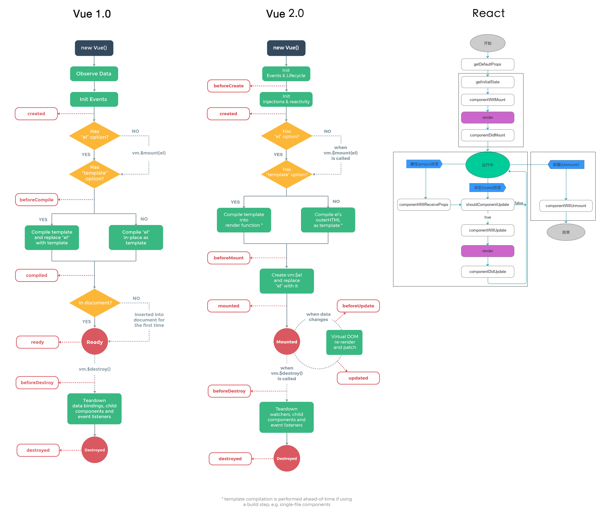

# Vue vs React

### 一、 组件与数据流
* **文件结构**
	* Vue：style标签 + template标签 + script标签
	* React：jsx / js

	
* **父子组件通信**
	* Vue：双向数据绑定，v-model来双向绑定变量
	* React：单向数据流，props传递数据到子组件，再通过props中的callback来回调父组件方法


#### Vue [代码示例](http://jsfiddle.net/wisteriaflash/b0a0m72c/)

```vue
<style lang="scss" src="demo.scss"></style>
<template>
  <h2>Todos:</h2>
  <ol>
    <li v-for="todo in todos">
      <label>
        <input type="checkbox"
          v-on:change="toggle(todo)"
          v-bind:checked="todo.done">

        <del v-if="todo.done">
          {{ todo.text }}
        </del>
        <span v-else>
          {{ todo.text }}
        </span>
      </label>
    </li>
  </ol>
</template>

<script>
export default {
  data: {
    todos: [
      { text: "Learn JavaScript", done: false },
      { text: "Learn Vue", done: false },
      { text: "Play around in JSFiddle", done: true },
      { text: "Build something awesome", done: true }
    ]
  },
  methods: {
  	toggle: function(todo){
    	todo.done = !todo.done
    }
  }
}
</script>
```

#### React [代码示例](https://jsfiddle.net/wisteriaflash/nc9qwy5L/2/)

```jsx
import React, { Component } from 'react';
import './demo.scss';

class TodoApp extends React.Component {
  constructor(props) {
    super(props)
    this.state = {
    	items: [
      	{ text: "Learn JavaScript", done: false },
        { text: "Learn React", done: false },
        { text: "Play around in JSFiddle", done: true },
        { text: "Build something awesome", done: true }
      ]
    }
  }
  
  toggleCheck(item) {
  	item.done = !item.done;
    this.setState({state: this.state});
  }
  
  render() {
    return (
      <div>
        <h2>Todos:</h2>
        <ol>
        {this.state.items.map(item => (
          <li key={item.id}>
            <label>
              <input type="checkbox" checked={item.done} onClick={() => {
              	this.toggleCheck(item);
              }} /> 
              <span className={item.done ? "done" : ""}>{item.text}</span>
            </label>
          </li>
        ))}
        </ol>
      </div>
    )
  }
}
```

### 二、 生命周期

### Vue1.0
* created
* beforeCompile
* compiled
* ready
* beforeDestroy
* destroyed

### Vue2.0
* beforeCreate
* created
* beforeMount
* mounted
* beforeDestroy
* destroyed

### React
* getDefaultProps
* getInitialState
* componentWillMount
* render
* componentDidMount
* componentWillReceiveProps
	* shouldComponentUpdate
	* componentWillUpdate
	* render
	* componentDidUpdate
* componentWillUnmount



### 三、 数据更新
#### Vue - $set [代码示例](https://jsfiddle.net/wisteriaflash/49n7g33f/9/)

```vue
<template>
<div id="app">
  <h2>{{title.name}}</h2>
  <p>tips:{{title.des}}</p>
</div>
</template>
<script>
export default {
  data: {
    title: {
    	name: 'ToDo -- a：'
    },
    /* title: {
      name: '',
      des: '',
    } */
  },
  ready(){
     /* this.title = {
      name: 'Todos',
      des: 'This is some todo list',
         } */
    this.title.name = 'ToDo -- b';
    this.title.des = 'This is some todo list';
    //this.$set('title', {name: 'ToDo -- c', des: 'This is some todo list'});
  },
}
</script>
```


#### React - setState [代码示例](https://jsfiddle.net/wisteriaflash/qsfe10gv/)
```jsx
class TodoApp extends React.Component {
  constructor(props) {
    super(props)
    this.state = {
    	items: [
      	{ text: "Learn JavaScript", done: false },
        { text: "Learn React", done: false },
        { text: "Play around in JSFiddle", done: true },
        { text: "Build something awesome", done: true }
      ]
    }
  }
  
  componentDidMount(){
  	setTimeout(() => {
    	this.setState({items: [{
      	text: 'change text', done: false
      }]});
    }, 2000);
  }
  
  render() {
    return (
      <div>
        <h2>Todos:</h2>
        <ol>
        {this.state.items.map(item => (
          <li key={item.id}>
            <label>
              <input type="checkbox" disabled readOnly checked={item.done} /> 
              <span className={item.done ? "done" : ""}>{item.text}</span>
            </label>
          </li>
        ))}
        </ol>
      </div>
    )
  }
}
```

### 四、模板与jsx
 * Vue: template是写在单文件组件中的，使用了基于 HTML 的模版语法
 * React: 放弃了模板而发明了JSX，通过render渲染方法，将 JSX + inline style + DOM写在了一起

#### Vue
```vue
<template>
<ol>
  <li v-for="todo in todos">
    <label>
      <input type="checkbox"
        v-on:change="toggle(todo)"
        v-bind:checked="todo.done">

      <del v-if="todo.done">
        {{ todo.text }}
      </del>
      <span v-else>
        {{ todo.text }}
      </span>
    </label>
  </li>
</ol>
</template>
```

#### React
```jsx
render() {
    return (
      <div>
        <h2>Todos:</h2>
        <ol>
        {this.state.items.map(item => (
          <li key={item.id}>
            <label>
              <input type="checkbox" disabled readOnly checked={item.done} /> 
              <span className={item.done ? "done" : ""}>{item.text}</span>
            </label>
          </li>
        ))}
        </ol>
      </div>
    )
  }
```

### 五、监听数据变更
* Vue: `watch`监听变量
* React: 表单完全受控，

#### Vue [代码示例](https://jsfiddle.net/wisteriaflash/uq2af1nr/1/)
```vue
<template>
<div id="app">
  <h2>Todos:</h2>
  <input v-model="text" />
  <span>{{showText}}</span>
</div>
</template>
<script>
export default {
  data: {
    text: '',
    showText: 'show: '
  },
  watch: {
    text(value) {
      this.showText = 'show: ' + value;
    }
  },
  methods: {
    toggle: function (todo) {
      todo.done = !todo.done
    }
  }
}
</script>
```

#### React [代码示例](https://jsfiddle.net/wisteriaflash/uq2af1nr/2/)
```jsx
class TodoApp extends React.Component {
  constructor(props) {
    super(props)
    this.state = {
      value: '',
      listData: [{
        name: 'a1'
      }, {
        name: ''
      }, {
        name: 'a3'
      }]
    }
    // bind
    this.handleChange = this.handleChange.bind(this);
  }


  componentDidMount() {
    const { listData } = this.state;
    const moreData = [{
      name: 'a4'
    }, {
      name: ''
    }]
    const newListData = listData.concat(moreData);


    setTimeout(() => {
      this.setState({
        listData: newListData
      });
    }, 2000);
  }

  handleChange(e) {
    const value = e.target.value;
    this.setState({ value });
  }

  render() {
    const { value, listData } = this.state;

    return (
      <div>
        <h2>Todos:</h2>
        <input
          value={value}
          onChange={this.handleChange}
        />
        {value && <span>show: {value}</span>}
        <TodoList data={listData} />
      </div>
    )
  }
}

class TodoList extends React.Component {
  constructor(props) {
    super(props)
    this.state = {
      data: this.filterData(props.data)
    }
  }

  componentWillReceiveProps(nextProps) {
    if ('data' in nextProps) {
      const newData = this.filterData(nextProps.data);
      this.setState({ data: newData });
    }
  }

  filterData(data) {
    const newData = [];
    data.forEach((item) => {
      if (item.name) {
        newData.push(item);
      }
    })
    return newData;
  }

  render() {
    const { data } = this.state;

    return (
      <ul>
        {data.map((item, index) => (
          <li key={item.name}>{index + 1}、 {item.name}</li>
        ))}
      </ul>
    )
  }
}

ReactDOM.render(<TodoApp />, document.querySelector("#app"));
```


### 六、事件处理
* Vue: 通过`$emit`派发事件，然后在父组件中监听事件
* React: 触发在`props`中配置事件的`callback`

### Vue [代码示例](https://jsfiddle.net/wisteriaflash/nfg7rLwq/)
```html
<!-- 子组件模板 -->
<template id="child-template">
  <input v-model="msg">
  <button v-on:click="notify">Dispatch Event</button>
</template>
<!-- 父组件模板 -->
<div id="events-example">
  <p>Messages: {{ messages | json }}</p>
  <child @child-msg="handleIt"></child>
</div>
```
```js
// 注册子组件
// 将当前消息派发出去
Vue.component('child', {
  template: '#child-template',
  data: function () {
    return { msg: 'hello' }
  },
  methods: {
    notify: function () {
      if (this.msg.trim()) {
        this.$emit('child-msg', this.msg)
        this.msg = ''
      }
    }
  }
})
// 初始化父组件
// 将收到消息时将事件推入一个数组
var parent = new Vue({
  el: '#events-example',
  data: {
    messages: []
  },
  methods: {
  	handleIt(msg) {
    	this.messages.push(msg);
    }
  }
})
```


### React [代码示例](https://jsfiddle.net/wisteriaflash/2ufa2035/)
```jsx
class TodoApp extends React.Component {
  constructor(props) {
    super(props)
    this.state = {
      items: [
        { text: "Learn JavaScript", done: false },
        { text: "Learn React", done: false },
        { text: "Play around in JSFiddle", done: true },
        { text: "Build something awesome", done: true }
      ],
      back: [],
    }
    //bind
    this.handleChange = this.handleChange.bind(this);
  }

  handleChange(items) {
    this.setState({ back: items });
  }

  componentDidMount() {
    this.handleChange(this.state.items);
  }

  render() {
    return (
      <div>
        <h2>Todos:</h2>
        <TodoList
          data={this.state.items}
          onChange={this.handleChange}
        />
        <h2>Select items:：</h2>
        {this.state.back.map((item) => {
          if (!item.done) {
            return <span className="tag">{item.text}</span>
          } else {
            return null;
          }
        })}
      </div>
    )
  }
}


class TodoList extends React.Component {
  constructor(props) {
    super()
    this.state = {
      data: props.data,
    }
    // bind
    this.toggleCheck = this.toggleCheck.bind(this);
  }

  toggleCheck(item) {
    const { onChange } = this.props;
    item.done = !item.done;
    this.setState({ data: this.state.data }, () => {
      // callback
      if (onChange) {
        onChange(this.state.data)
      }
    });

  }

  render() {
    const { data } = this.state;

    return (
      <ol>
        {data.map(item => (
          <li key={item.name}>
            <label>
              <input type="checkbox" checked={item.done}
                onChange={() => {
                  this.toggleCheck(item);
                }}
              />
              <span className={item.done ? "done" : ""}>{item.text}</span>
            </label>
          </li>
        ))}
      </ol>
    )
  }
}
```


### 七、列表渲染
* Vue: 使用v-for来渲染
* React: 使用map方法来循环，注意绑定的key值

#### Vue [代码示例](https://jsfiddle.net/wisteriaflash/b0a0m72c/)


#### React [代码示例](https://jsfiddle.net/wisteriaflash/nc9qwy5L/2/)

key值的绑定：
[级联选择-Cascader](http://mo.jd.com/jdc/spirit/dist/#/page/components/casecader)


### 八、过渡动画
* Vue：提供了`transition `的封装组件
* React：可以自行选择动画库，例如`react-transition-group`


### Vue [代码示例](https://jsfiddle.net/wisteriaflash/jps0makk/)

```vue
<style>
body {
  background: #20262E;
  padding: 20px;
  font-family: Helvetica;
}
.expand-transition {
  transition: all .3s ease;
  height: 30px;
  padding: 10px;
  background-color: #eee;
  overflow: hidden;
}
.expand-enter, .expand-leave {
  height: 0;
  padding: 0 10px;
  opacity: 0;
}
</style>
<template>
<div v-if="show" transition="expand">hello</div>
<br/>
<button @click="toggle">toggle</button>
</template>
<scirpt>
export default {
	data: {
    show: true
  },
  methods: {
  	toggle: function(){
    	this.show = !this.show;
    }
  }
}
</script>
```

### React [示例](https://codesandbox.io/s/m77l2vp00x?from-embed)

* [react-transition-group](https://reactcommunity.org/react-transition-group/css-transition)
* [react-motion](https://github.com/chenglou/react-motion)
* data-show： [react-move](https://github.com/react-tools/react-move)


### 两者的共同点
* 都使用 Virtual DOM (Vue2.0)
* 提供了响应式（Reactive）和组件化（Composable）的视图组件。
* 将注意力集中保持在核心库，伴随于此，有配套的路由和负责处理全局状态管理的库。


  
### 组件演示：select [示例](http://mo.jd.com/jdc/spirit/dist/#/page/components/select)


* [ant-design](https://ant.design/components/select-cn/)
* [element](http://element.eleme.io/#/zh-CN/component/select)

#### 优化点：
* 列表显示的方向动画：通过更改`transform-origin`来实现方向的变更
